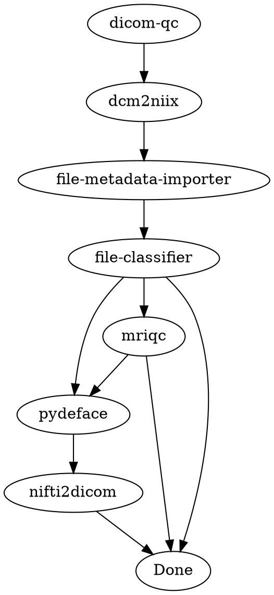
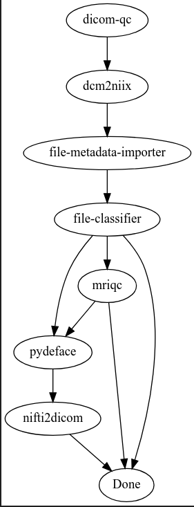
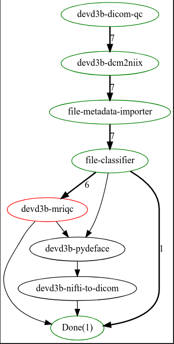

# Directed Acyclic Graphs for Flywheel Gears

This library provides a framework for creating and executing Directed Acyclic Graphs
(DAGs) with Flywheel Gears, enabling efficient and flexible management of complex
workflows involving multiple gears.

## Quick Start

```python
# Install the package
pip install dag_objects-0.1.0-py3-none-any.whl

# Import and use
from dag_objects import GraphTemplate, Node, Edge
```

## Table of Contents

- [Directed Acyclic Graphs for Flywheel Gears](#directed-acyclic-graphs-for-flywheel-gears)
  - [Quick Start](#quick-start)
  - [Table of Contents](#table-of-contents)
  - [Background](#background)
  - [Key Components](#key-components)
    - [Nodes](#nodes)
    - [Edges](#edges)
    - [Graph Template](#graph-template)
  - [Creating a Graph](#creating-a-graph)
  - [Executing a Graph](#executing-a-graph)
    - [Visualizing an Executing Graph](#visualizing-an-executing-graph)
  - [More Complex Workflows](#more-complex-workflows)
  - [Installation](#installation)
  - [Examples](#examples)
  - [Video Tutorial](#video-tutorial)
  - [Support](#support)
  - [Disclaimer](#disclaimer)

## Background

Flywheel's "Gear Rule" utility triggers gears based on file-based conditions, which can
be limiting for complex workflows. DAGs provide a more structured approach where:

- Each gear has dependencies (inputs/configs) and produces outputs
- Dependencies and outputs can be used by downstream gears
- Gears launch automatically when dependencies are met
- The process continues until all gears in the workflow complete

## Key Components

### Nodes

A node represents a gear with properties:

- `gear`: The associated gear
- `graph_inputs`: Required inputs
- `fixed_inputs`: Fixed inputs
- `config`: Configuration options
- `job`: Associated job

### Edges

An edge represents a dependency between nodes with properties:

- `source`: Source node
- `target`: Target node
- `graph_inputs`: Required inputs with:
  - `source_input_name`: Input name in source node
  - `target_input_name`: Input name in target node
  - `use_input`: Boolean for input usage
  - `conditions`: Conditions for edge satisfaction

### Graph Template

Hosts nodes and edges, allowing parallel execution of multiple graphs based on
triggering jobs.

## Creating a Graph

Graphs are defined using DOT language, a simple text format for describing graphs:



Edge inputs are defined using disabled gear rules as placeholders:

```
dicom-qc: [[S]]
dcm2niix: [[S->a]]
file-metadata-importer: [[a->b]]
file-classifier: [[b->c]]
mriqc: [[c->d]]
pydeface: [[c->e]]
pydeface: [[d->e]]
nifti2dicom: [[e->f]]
```

A graph can be visualized using the DOT language:



## Executing a Graph

These graphs can be as simple as a single gear or as complex as a multi-gear workflow.
The example above is a simple workflow for neuro imaging data QC.

The DAG engine:

1. Checks dependencies of each gear
2. Launches gears when dependencies are met
3. Monitors completion and launches downstream gears
4. Continues until all gears complete

See `dag_demo.ipynb` for a complete example.

### Visualizing an Executing Graph

An executing graph can be visualized using the DOT language:



Node colors indicate status:

- Black: Waiting
- Blue: Running
- Green: Finished
- Red: Failed

Edge numbers show jobs traversing that path.

## More Complex Workflows

More complicated workflows (e.g. [Adolescent Brain Cognitive Development (ABCD)
Study](https://www.ncbi.nlm.nih.gov/core/lw/2.0/html/tileshop_pmc/tileshop_pmc_inline.html?title=Click%20on%20image%20to%20zoom&p=PMC3&id=6981278_nihms-1543097-f0001.jpg))
are also possible.

With the simple example above and knowledge of Flywheel Gear Rules, you can create and
execute complex workflows.

## Installation

```bash
# Install from GitHub release
pip install https://github.com/joshicola/public_dag_prototype/releases/download/0.1.0/dag_objects-0.1.0-py3-none-any.whl

# Or download and install locally
pip install dag_objects-0.1.0-py3-none-any.whl
```

## Examples

See the included `dag_demo.ipynb` notebook for a complete workflow example.

## Video Tutorial

The following video demonstrates the prototype in action:

[](https://www.youtube.com/watch?v=_0JUfkzFlS0)

## Support

For issues or questions, please open an issue on the [GitHub
repository](https://github.com/joshicola/public_dag_prototype/issues).

## Disclaimer

This is a prototype and is not intended for production use. It is provided as-is and
without warranty. Use at your own risk.

This project was created as a personal passion project and is not affiliated with
Flywheel in any way.

If you have questions, feedback, or suggestions, please feel free to reach out.
