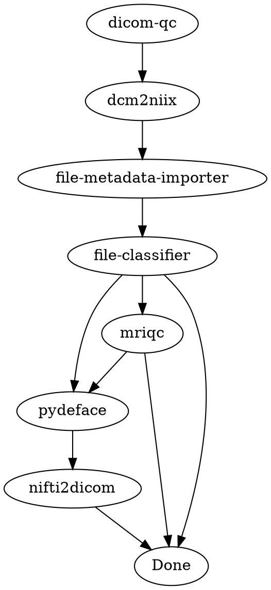

# Directed Acyclic Graphs Prototype

This repository contains a prototype for using Directed Acyclic Graphs (DAGs) with
Flywheel Gears. The goal is to provide a more efficient and flexible way to manage and
execute complex workflows involving multiple gears.

## Background

Flywheel provides a "Gear Rule" utility to trigger gears based on specific file-based
conditions. However, this approach can be limiting when dealing with complex workflows
that involve multiple gears and dependencies. DAGs offer a more structured and effective
way to manage such workflows.

The principle is this:

Each gear has a set of dependencies (inputs and configuration options) and produces a
set of outputs. Each of these dependencies and outputs can be used as dependencies for
downstream gears.

Once a gear has all of its dependencies met, it can be launched. When the gear
completes, downstream gears are checked to see if they can be launched. This process
continues until all gears in the DAG have been launched.

## Prototype Features

### Nodes

A node represents a gear in the DAG. Each node has the following properties:

- `gear`: The gear associated with the node.
- `graph_inputs`: The inputs required for the gear to run.
- `fixed_inputs`: The fixed inputs for the gear.
- `config`: The configuration options for the gear.
- `job`: The job associated with the gear.

### Edges

An edge represents a dependency between two nodes in the DAG. Each edge has the following
properties:

- `source`: The source node of the edge.
- `target`: The target node of the edge.
- `graph_inputs`: The inputs required for the edge to be satisfied. The structure of the
  `graph_inputs` is as follows:
  - `source_input_name`: The name of the input in the source node.
  - `target_input_name`: The name of the input in the target node.
  - `use_input`: A boolean indicating whether the input is used or not.
  - `conditions`: The conditions that must be met for the edge to be satisfied.

### Graph Template

The Nodes and Edges of a graph are hosted in a graph template. A graph template allows
us to execute multiple graphs in parallel...depending on the number of triggering jobs.

### Defining a Graph

A graph is defined using a DOT language representation. The DOT language is a simple
text-based format for describing graphs. The graph template is then generated from the
DOT representation.

For example:



This defines a simple DAG with seven gears: `dicom-qc`, `dcm2niix`, `file-metadata-importer`,
`file-classifier`, `mriqc`, `pydeface`, and `nifti2dicom`. The `Done` node represents the
end of the graph.

The `graph_inputs` for the edges of the graph are defined using disabled gear rules.
These rules act as placeholders for the inputs required for the edges to be satisfied.

The gear rules themselves are not used in the DAG execution. Instead, the DAG engine
manages the execution of the gears based on the dependencies defined in the graph.

These gear rules have names that identifies them as edges in the graph.

For example:

```
dicom-qc: [[S]]
dcm2niix: [[S->a]]
file-metadata-importer: [[a->b]]
file-classifier: [[b->c]]
mriqc: [[c->d]]
pydeface: [[c->e]]
pydeface: [[d->e]]
nifti2dicom: [[e->f]]
```

### Executing a Graph

These graphs can be as simple as a single gear or as complex as a multi-gear workflow.
The example above is a simple workflow that involves seven gears involved in a QC
pipeline for neuro imaging data.

The graph is executed by the DAG engine. The engine checks the dependencies of each gear
and launches the gears in the correct order. When a gear completes, the engine checks
the dependencies of the downstream gears and launches them if they are ready. This
process continues until all gears in the graph have been launched. An example of an
executable workflow is given in the `dag_demo.ipynb` notebook.

More complicated workflows (e.g.
[Adolescent Brain Cognitive Development (ABCD) Study](https://www.ncbi.nlm.nih.gov/core/lw/2.0/html/tileshop_pmc/tileshop_pmc_inline.html?title=Click%20on%20image%20to%20zoom&p=PMC3&id=6981278_nihms-1543097-f0001.jpg))
are also possible.

With the above simple example and knowledge of Flywheel Gear Rules, it is possible to
create and execute a more complex workflow.

## Usage

The library is provided as a release artifact on GitHub.

- [Release Artifacts](https://github.com/joshicola/public_dag_prototype/releases/tag/0.1.0)
- [Wheel File](https://github.com/joshicola/public_dag_prototype/releases/download/0.1.0/dag_objects-0.1.0-py3-none-any.whl)
- [Gzipped Tarball File](https://github.com/joshicola/public_dag_prototype/releases/download/0.1.0/dag_objects-0.1.0.tar.gz)

To use the library, simply download the preferred release artifact and install it using
pip.

## Video Example

The following video demonstrates the prototype in action. It shows how to create a DAG,
visualize it, and execute it using Flywheel Gears.

[](https://www.youtube.com/watch?v=_0JUfkzFlS0)

## Disclaimer

This is a prototype and is not intended for production use. It is provided as-is and
without warranty. Use at your own risk.

I created this project as a personal passion project and I was able to work on it in my
free time. It is not affiliated with Flywheel in any way.

If you have any questions, feedback, or suggestions, please feel free to reach out to
me. I am happy to help and I am always open to feedback and suggestions.
